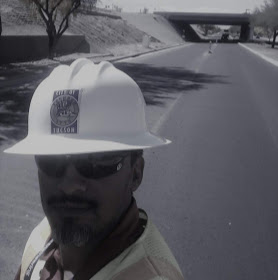

<!DOCTYPE html>

<html>

<head>
    <title>Fabian's Resume Information</title>
    <link rel="stylesheet" type="text/css" href="indexCSS.css">
</head>

<body>
    

        
         
        <h1 style="text-align: center;"><b>Arizona State University Student Resume</b>
            

        </h1>
    

     
     
    

        

            
        

        

            <h1 style="text-align: center;">Fabian B. Shenk
                

            </h1>
            <a href="mailto:fshenk@asu.edu">Send email</a>
             
             
            <a href="https://www.linkedin.com/in/fabianshenk/" target="_blank"> Click to visit Fabian's profile</a>
        

    

    

    

        

        <h2><b>Education</b></h2>
         
        <ul>
            <li class="alignleft"> MS in Geographic Information Systems 
August,2021 - Arizona
                    State University – Tempe, Arizona GPA: InProgress/4.0
 
            </li>
            <li class="alignleft">Bachelors of Science in Geographic Information Science 
December
                    2019 Arizona State University – Tempe, Arizona GPA: 3.99/4.0 Dean’s List 2019 

            </li>
            <li class="alignleft">Associates of Science, Liberal Arts and AGEC December 2014 
Pima
                    Community College – Tucson, Arizona GPA: 2.8

            </li>
        </ul>
         
    

    

    

     
    

        <h2><b>Experience</b></h2>
        <ol>
            <li class="alignleft"><b> GIS Technician, Pima County Internet Technology Department</b> <i
                    class="alignright">August 2020 to March 2021</i> 
                
<a href="https://webcms.pima.gov/" target="_blank">
                        <code>Pima County</code></a>

                

                <ul>
                    Interpret As-Built Drawings from current to historical records and transitioned this understanding
                    over
                    nodes and lines to model work installed under contract within a GIS system 
                    Support different departments with tasks to complete and perform to expectations set by these
                    different
                    departments to complete the tasks accordingly and efficiently 
                    Process permit, subdivision plats, and other documentation requiring geodetic processing and
                    modeling where
                    utility and infrastructure work for new installation, repairs, or rehabilitation. 
                     
                </ul>
            </li>
            <li class="alignleft"><b>Senior Engineering Associate, City of Tucson Engineering Department</b><i
                    class="alignright">September 2018 to August 2019</i> 
                

                    <a href="https://www.tucsonaz.gov/" target="_blank"><code>City of Tucson</code></a>
                

                

                <ul>Maintained complaints log (illicit discharge, spill complaints, commercial issues, residential
                    issues, &
                    other various Storm-Water concerns) database and worked with projects for the 
                    City of Tucson by Conducting project field inspections, determining project conflicts, noting
                    compliance
                    with plans and standards. 
                    Participated in weekly inspections of facilities with regards to life, safety, & health. Focus on
                    Multi-Agency Inspection Team with regards to Storm-Water and ensuring 
                    city compliance with Municipal Construction permit 
                    Acted as a regulatory specialist with respects to laws and regulations pertaining to Storm-Water by
                    Studying
                    Tucson City Code, especially regarding floodplain and stormwater compliance with MS4, Federal
                    Register with
                    regards to EPA references, OSHA standards with regards to safety and compliance, and AZPDES permit
                    requirements 
                    Collected environmental samples, labeled accordingly for proper data recording, transported samples
                    of
                    fluids, solids, effluents, etc., from sample locations to lab 
                    Assisted engineers with processing technical plan reviews and SWPPP design documents, obtain
                    records, and
                    established technical communication 
                     
                </ul>
            </li>
            <li class="alignleft"><b>GIS Database Manager, University of Arizona Arboretum</b><i
                    class="alignright">October 2017 to March 2018</i> 
                

                    <a href="https://arboretum.arizona.edu/contact" target="_blank"> <code>UArizona Arboretum</code></a>
                

                

                <ul>
                    Efficiently worked with the Director of the Arboretum with relational database issues, schema
                    representation
                    and student workers needing queries on data 
                    Digitized and maintained tree, shrub, and various plant data for the arboretum using ArcGIS Online
                    and
                    Collector Application produced for tree collection 
                    Gained experience in reviewing data integration and integrity through relational databases and
                    performing
                    attribute field queries in an enterprise setting 
                     
                </ul>
            </li>
            <li class="alignleft"><b>Traffic Engineering Technician, City of Tucson Traffic Engineering Department</b><i
                    class="alignright">March 2016 to April 2020</i> 
                

                    <a href="https://www.tucsonaz.gov/" target="_blank"><code>City of Tucson</code></a>
                

                

                <ul>
                    Maintained sign geo-database with new, replaced, or missing sign status using ArcMap and associating
                    work
                    using an Asset Management System to ensure work was trackable and done in a timely fashion 
                    Facilitated planning with regards to projects associated to signs and striping of pavement markings
                    within
                    jurisdiction and performed inspection on these projects to ensure work to approved standards 
                    Maintained barricade, traffic control, sign, and pavement inspection status to have the authority to
                    approve
                    work done by others and according to standards set by plan drawings, specification book, and other
                    manuals
                    for traffic control devices 
                    Assisted professional planning and engineering staff by compiling, evaluating, analyzing, and
                    illustrating
                    accident reports and records by preparing descriptive materials and illustrations 
                    Codes, digitizes, and at times field verifies, and edits electronic maps and their related
                    geographic
                    attributes including ground-truthing or additional research to verify/situate issues. 
                    Document activities and various observations using memos, spreadsheets and internal formatted
                    documentation
                    including creating map documents to display and communicate effectively the task to complete 
                    Conducted and investigated code impedance on Right-Of-Way issues by evaluating legal compliance with
                    land
                    use codes using the Development and Standards by the COT and AASHTO Sight Visibility Triangle
                    Process of
                    evaluation
                     
                     
                </ul>
            </li>
            <li class="alignleft"><b>Permits & Code Technician, City of Tucson Engineering Department</b><i
                    class="alignright">October 2014 to March 2016</i> 
                

                    <a href="https://www.tucsonaz.gov/" target="_blank"><code>City of Tucson</code></a>
                

                

                <ul>
                    Assisted customers through processing permit for Right-Of-Way use and understanding by-laws and
                    guidelines
                    to work safely and efficiently within the public Right-Of-Way 
                    Evaluated paperwork and plan submittals prior to submitting to transportation review group to make
                    sure
                    complete and work is being represented on both permit and drawing accordingly 
                    Created and maintained data, attributes, and features within map for permit group to ensure work
                    displayed
                    appropriately and communicate work being done in the area 
                    Organized office records and compiled files electronically to maintain historical records in both
                    electronic
                    and manual format 
                    Knowledge of local government process and ability to research records for customers 
                     
                </ul>
            </li>
        </ol>
         
    

    

    

    <h2><b>Skills</b></h2>
    

        Proficient in Microsoft Office, Google, Jupyter Notebooks, general software and technological uses 
        Understanding of other various software: GeoDa, Oracle, SIRE, Cartegraph, R-Studio, Anaconda 
        Intermediate and continuous learning in Python, R-Language, J-SON, JAVA, Arcade, C++, HTML, CSS, JavaScript 
        Knowledge and use of OpenStreetMap, QGIS, and other open-source software 
        Advanced Proficient level utilizing the Arc-Suite applications, including: ArcCatalog, ArcMap10.3 and above, Arc
        Geo-Processing Tools,
        Arc-Pro 2.2 and above, Model-Builder, ArcGIS online, Web Maps and applications
    

    

    

        <!---->
         
        <h4 style="text-align: center;"><b>Thank you for visiting! Please don't forget to <a
                    href="mailto:fshenk@asu.edu" target="_blank">Email</a> or connect with me
                on <a href="https://www.linkedin.com/in/fabianshenk/" target="_blank">LinkedIn.</a></b>
            

        </h4>
    

</body>

</html>
